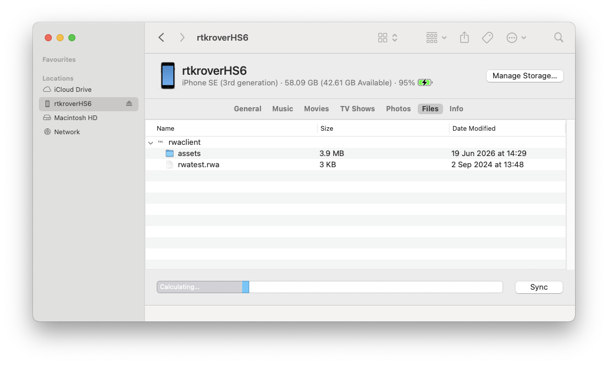

# Frequently Asked Questions

## Editing in RWA Creator

### How do moving assets work?

* In the *State view* of RWA Creator, select your asset and toggle the *Moving asset* box. This will make a :rwa-audiosourcestartpoint1: icon appear at the center of the given state, which determines the starting position of your moving asset, and it will move along a straight path until it reaches the :rwa-audiosource: icon. Upon starting simulation (:rwa-start:), your moving asset will appear as a :rwa-audiosourcestartpoint: icon in the *Map view*. The speed at which your moving asset moves from :rwa-audiosourcestartpoint1: to :rwa-audiosource: is determined in m/s by the value of the *Moving speed* field.

### How do rotating assets work?

* **Binaural-stero** assets: toggling the *Rotating asset* box field in the *State view* will make the two :rwa-audiochannelsource: channels rotate around their :rwa-audiosource: icon. The rotation trajectory is determined by defining in Hz the *Rotate Frequency* field, and the Channel radius in meters by the *Channel Radius* field in the *State view*.

* **Binaural-mono** assets: when working with binaural-mono sources, it is necessary to toggle *Enable custom channel-positions*, so that the :rwa-audiochannelsource: becomes visible. Its trajectory is defined by *Rotate Frequency* and *Channel Radius* just as with binaural-stereo assets.

## How to copy a Game to the iPhone?

Connect the iPhone to your laptop, it will show up in the Finder-windows under the *Locations* section. In the *Files* tab, you see the storage-folders of all apps supporting file-transfer, including the **rwaclient**[^naming]. Drag the project folder onto the **rwaclient** entry to copy your game to the iPhone. Once the transfer is complete, disconnect the device and restart the RWA Player app.

/// caption
The app storage folder in the Files tab of a connected iPhone in Finder
///

!!! warning "Beware of the *undo* folder"
    When exporting you game, make sure to choose the right export option! If you copy your project folder including its *undo* folder, each undo state will show up as a game in the *RWA Player* app. This is most certainly not what you want. A correctly exported project folder contains only the `<project-name>.rwa` file and the `assets` folder with your audio/Pd assets.

[^naming]: Previously, the **RWA Player** app was named *rwaclient* and/or *rwa-client*. It is an ongoing (and complicated) process of finally renaming all occurrences consistenlty into **RWA Player**. During this period, *rwaclient* and/or *rwa-client* will still show up in some places, including in the app storage folder list.
