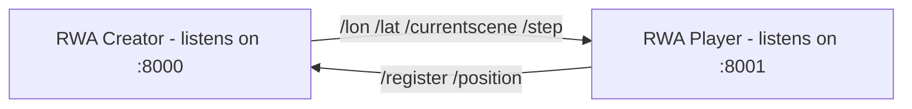

# Technical Details

Written against RWA Player 1.3.0 and RWA Creator 1.4.1.

## How do RWA Player and Creator communicate?

Both apps exchange control data as **OSC messages over UDP**, and projects as
plain **HTTP** downloads (see
[below](#how-are-projects-transferred-onto-the-phone)). Everything happens on
the local network, there is no server in between, and no pairing beyond entering
the laptop's IP address on the phone.

Each app listens on its own port:

The two ports are deliberately different: it allows both directions to run on
the same machine, which is the case when the Player runs in the Xcode Simulator.

RWA Creator listens on port 8000 whenever it is running. The Player only listens
on port 8001 while it is *registered* - and only while the [Control View] is on
screen.

[Control View]: ../rwa-player/control-data-view.md

### What the Player sends to RWA Creator (:8000)

| Message | Arguments | Sent when |
| --- | --- | --- |
| `/register` | Hero name, IP address of the phone | You tap **Register** in the [Settings View]. The address is the phone's Wi-Fi address, with the cellular interface as fallback. RWA Creator replies to *that* address on port 8001. |
| `/position` | longitude, latitude | Every GPS update, while **Send GPS to Creator** is on *and* the phone is not registered. See [Live GPS in RWA Creator]. |

[Settings View]: ../rwa-player/settings-view.md
[Live GPS in RWA Creator]: ../creating-soundwalks/live-gps-in-rwa-creator.md

### What RWA Creator sends to the Player (:8001)

| Message | Arguments | Sent when... | What the Player does with it |
| --- | --- | --- | --- |
| `/lon`, `/lat` | coordinate | ...the Hero is moved in the [Map View](../rwa-creator/map-view.md) - by dragging it, or through *Hero Follows Selection* | Moves the Hero. The Player's own game engine then decides which scenes, states and assets that position triggers. |
| `/currentscene` | scene name | ...the simulation starts, and whenever you select a different scene while the simulation is **stopped** | Switches scene: running assets are ended, the background state of the new scene starts. |
| `/step` | `1` | ...the connected RWA Headtracker reports a footstep, or you press :rwa-headtrackerStepButton: *Send Footstep* in the Map View toolbar | Sends a bang into Pd patches that react to footsteps (`[r $0-step]`) and counts the step (shown in the Control View) |

Note that the Hero position is the only *continuous* stream (while moving the Hero). Scene changes and
footsteps are one-shot events, and everything else the Creator knows - states,
asset parameters, the audio it renders itself - stays on the laptop. The phone
runs its own copy of the game and its own audio engine; RWA Creator only tells it
at which coordinates the listener is located.

!!! info "Not sent: head orientation"
    Azimuth and elevation from a headtracker connected to RWA Creator stay in the
    Creator. Only the footstep event is forwarded. A phone that needs head
    orientation has to have its own headtracker connected.

!!! info "No bi-directional location exchange"
    You can't send GPS and receive the Hero position at the same time, because
    both would fight over the same variable (the Hero's position) and the last
    message to arrive would win.

    The Player therefore treats the two directions as mutually exclusive:
    registering with RWA Creator stops the phone's own location updates, and
    `/position` is only sent while the phone is *not* registered. So the phone
    is either the source of the position ([Live GPS in RWA Creator]) or the
    receiver of it ([Simulating Location on the Phone]), never both.

!!! note "Data exchange with other software"
    The OSC API laid out above can be used by other software as well: You may
    replace the Creator and/or the Player by software like a GPX player to send
    in pre-recorded walks for testing, or recording those, or Max/MSP for
    experimentation and testing.

[Live GPS in RWA Creator]: ../creating-soundwalks/live-gps-in-rwa-creator.md
[Simulating Location on the Phone]: ../creating-soundwalks/simulating-location-on-the-phone.md

### What can go wrong?

UDP is fire-and-forget: nothing is acknowledged and nothing is resent. Neither
app can tell whether the other one is listening, so a wrong IP address, a
different Wi-Fi network or a firewall look exactly like "nothing happens". Watch
the [Log View] in RWA Creator, it reports a successful registration.

[Log View]: ../rwa-creator/log-view.md

Known bugs:

- **The Player stops listening when you leave the Control View.** Incoming Hero
  positions are only processed while that view is open.
- **RWA Creator never forgets a device.** Unregistering on the phone is not
  announced, and every registration adds an entry. Restart RWA Creator if it
  keeps sending to a phone that has left the network.

### How are projects transferred onto the phone?

Through the *Sharing Server* :rwa-syncwithclients:, an HTTP server that RWA
Creator runs on port 8088 while activated. It serves the sharing folder as plain
files: the Player first fetches `allfiles.txt` (the list of available projects) and
then downloads the `.zip` of each project in that list.

This is independent of OSC: the phone does not have to be registered to fetch
projects, only to be on the same network. See [Transferring Projects].

[Transferring Projects]: ../creating-soundwalks/transferring-projects.md#transfer-projects-over-wifi

## How precise are the coordinates that get transmitted?

Coordinates travel as 32-bit floats in both directions. At Central European
latitudes that quantises the transmitted latitude to roughly **0.4 m** steps
(longitude is finer, a few centimetres).

That is well below the accuracy of the GPS fix itself, where it would not
matter, but the newer head tracker builds with RTK GNSS claim sub-centimeter
precision in optimal conditions (at leas theoretically).
