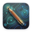

# RWA Documentation

## RWA Creator

<!--iconutil -c iconset ../../../../rwa-creator/images/rwa-creator.icns -o ./rwa-creator.iconset-->
<!--cp rwa-document.iconset/icon_32x32@2x.png rwa-document-icon-small.png-->
{align=right}

[Manual](./rwa-creator/index.md)

RWA Creator, the [Desktop Application for Real World Audio (RWA)](https://github.com/rnd-hsm-klassik/rwa-creator),
is used to create and simulate interactive binaural sounwalks.

## RWA Player (iOS Client)

{align=right}

[Manual](./rwa-player/index.md)

Soundwalks created in RWA Creator are loaded withing the [RWA Player App for iOS](https://github.com/rnd-hsm-klassik/rwa-client).
The iOS devices running the app are used with custom headphones, featuring GPS positioning and headtracking.

## Creating Soundwalks

[Guides](./creating-soundwalks/index.md)

Beyond the two application manuals, this section covers the artistic, creative and technical work on actual
soundwalks - topics that span both applications and take you out into the field.

## FAQ

[FAQ](./faq/editing-in-rwa-creator.md)

Frequently Asked Questions and answers.
