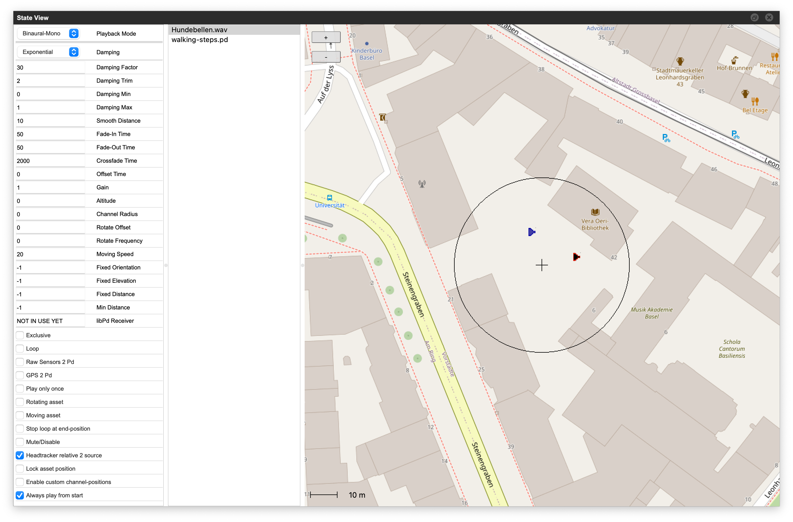

# RWA Creator Manual

## General Game Structure

- A *game* consists at least of one *scene*, a *scene* is usually located at a certain GPS position.
- A *scene* consists at least of two *states*: a *background* and a *fallback state*. The *background state* is always active for the whole *scene*. The *fallback state* is entered if no other (except the *background state*) is active. A new *state* can either be created by double clicking into the *map view*, or by select *news tate* from the state menu.
- A state should hold at least one *asset*. Otherwise it has no purpose. An asset can either be an *audio file* or a *Pure Data patcher*.
- All views render by default the last touched *scene*, *state* and *asset*. Therefore, if a state is touched within the *map view*, the *state view* automatically renders the same *state*.

## Map View

### Tools

- **Arrow**: double clicking in *Map View* creates a new *state*. Clicking on an existing *state* selects it; click and drag moves an existing *state*; click+drag on the map moves the map
- **Rubber**: deletes a *state*.

### Show assets/radii

- **Blue speaker**: shows or hides assets in *Map View*
- **Circle**: shows or hides radii in *Map View*

### Start/Stop Simulation

- Green Triangle: starts simulation
- Red Button: stops simulation

### Enter scene location

needs internet connection

- Enter the scene location; suggestions are made by open street maps nominatim server

!!! important "Rate Limits, Suggestions for H.E.I. Campus"
    The documentation for the [OSM Nominatim Service](https://operations.osmfoundation.org/policies/nominatim/)
    that provides the location lookup, describes its use for auto-complete search as "*unacceptable use*".
    The requirements further state: "*No heavy uses (an absolute maximum of 1 request per second)*".
    For **H.E.I. Campus**, the location lookup was switched to the
    [Swisstopo REST web geoservices](https://www.swisstopo.admin.ch/en/rest-api-geoservices-reframe-web).

### Menus

- **Select Scene**: select the current scene
- **Select State**: select the current state; map moves automatically to the selected state
- **Scene Menu**: allows for creating a new scene; delete the current scene; other options not working yet
- **State Menu**: allows for creating a new state; so far the only way to create a non-gps state

## State View

**Asset Attributes** (left), **Asset List** (center), **Asset Map View** (right)

### General Usage

In the *Asset List*, assets can be added via drag & drop; so far only `.wav` and `.aif` files are working.
After adding an asset, it appears instantly in the *Asset Map View*, where it can be placed with the mouse.
Clicking on an asset either in the list or the map selects the corresponding asset;
its attributes are shown in the *Asset Attributes* list and can be edited there.
Several assets can be selected by holding down the Command-key and clicking on the assets in the list.
Their attributes then can be edited together.
An asset can be removed from a state with the Delete-key, if it is selected.
Click+drag allows for editing the state radius.

## Scene View
