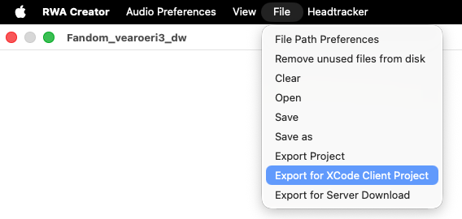
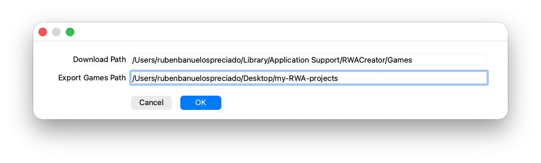
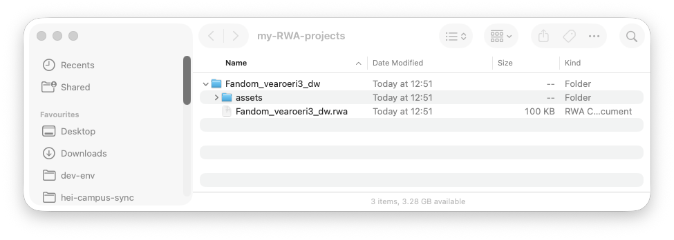

# Exporting RWA Creator Projects for use in the RWA Player mobile app

## Server Export (in tool bar as "Export as Server Download")

## Manually (in tool bar as "XCode Client Project")
1. On the main toolbar, navigate *File > Export for XCode Client Project*.
{align=center width=75%}

2. Your project will be saved to the *Export Games Path*  path specified in *File> File Path Preferences*.

3. Your saved project is a folder containing the .rwa project as well as its corresponding *assets* folder.

This folder and its contents are the only items that you will have to import to *RWA Player* in order to experience your RWA project in as a GPS-based soundwalk. In our section about [RWA Player](../rwa-player), you will find all the necessary information to navigate the *RWA player* mobile app and its integration with the *RWA Creator* software.
