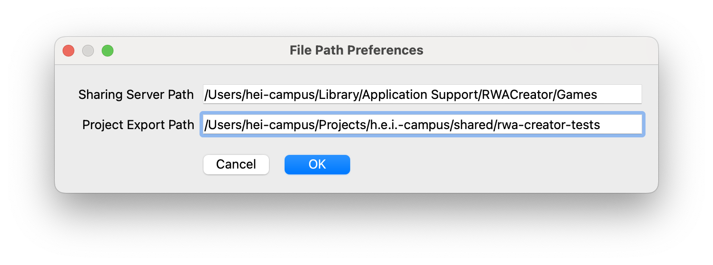

# Transferring Projects

There are two ways to get a project from *RWA Creator* onto the iPhone running *RWA Player*:

- **Over WiFi**, using the *Sharing Server* built into *RWA Creator*, no cable required.
- **Manually**, by exporting the project to disk and copying it to the device over a USB connection.

## Transfer projects over WiFi

*RWA Creator* contains a small file server that *RWA Player* can download games from. Instead of exporting the
project and transferring it by cable, both devices talk to each other over the local network.

### Requirements

- The iPhone (running *RWA Player*) and the laptop (running *RWA Creator*) are in the **same WiFi network**.
  The personal hotspot of your iPhone works well for this, e.g. when you are out in the field.
- You know the **IP address of the laptop** running *RWA Creator*.

### Steps

1. In *RWA Creator*, toggle :rwa-syncwithclients: *Activate Sharing Server* in the [Map View](./map-view.md#toggle-sharing-server)
   toolbar. The server now serves the exported projects to the local network.
2. Navigate to *File > Send Project to Sharing Server...*. This bundles your project into a `.zip` file and stores it in
   the folder specified as *Sharing Server Path* in *File > File Path Preferences*.
   
3. On the iPhone, open the *Settings* tab of *RWA Player* and enter the **IP address** of the laptop running
   *RWA Creator*.
4. Switch to the [Games View](../rwa-player/games-view.md) and tap **Fetch Games**. All games offered by the
   *Sharing Server* are transferred to the phone and appear in the list.

!!! warning "Fetching replaces all games on the phone"
    **All games already on the phone are deleted before the new ones are loaded.** Whatever the Sharing Server
    offers at that moment is what you end up with on the device.

!!! tip "Keep the server folder tidy"
    Every export adds another `.zip` file to the *Sharing Server Path*, and every one of them is transferred
    on each fetch. Clean out projects you no longer need, otherwise transfers become unnecessarily slow.

## Transfer via USB

1. On the main manu, navigate *File > Export Project for transfer to RWA Player...*.
   This will export your project to the *Project Export Path* specified in *File > File Path Preferences*.
   Your saved project is a folder containing the `.rwa` project file as well as its corresponding *assets*
   folder. This folder and its contents are the only items that you will have
   to copy to *RWA Player* in order to experience your RWA project as a GPS-based soundwalk.
   

2. Connect the iPhone to your laptop, it will show up in the Finder-windows under the *Locations* section.
   In the *Files* tab, you see the storage-folders of all apps supporting file-transfer, including the **RWA Player**.
   Drag the freshly exported project folder onto the *RWA Player* entry to copy your game to the iPhone.
   

3. Once the transfer is complete, disconnect the device and restart the *RWA Player* app.

!!! warning "Beware of the *undo* folder"
    When exporting you game, make sure to choose the right export option! If you copy your project folder including its *undo* folder, each undo state will show up as a game in the *RWA Player* app. This is most certainly not what you want. A correctly exported project folder contains only the `<project-name>.rwa` file and the `assets` folder with your audio/Pd assets.

In our section about [RWA Player](../rwa-player), you will find all the necessary information to navigate the *RWA Player* mobile app and its integration with the *RWA Creator* software.
