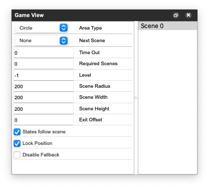

# Game View

/// caption
**Game View**: Scene Attributes (left), Scene List (right)
///

The *Scene List* shows all scenes of the current game. Selected scenes can be removed with the ++delete++ key. The *Scene Attributes* show the attributes of the Scene selected in the *Scene List*. The States belonging to the selected Scene are shown in the *State List* in the [*Scene View*](scene-view.md).

## Scene Attributes

| Attribute Name           | Default Value | Unit | Description                                                                                                                                       |
| ------------------------- | ------- | ---- | ------------------------------------------------------------------------------------------------------------------------------------------------- |
| Area Type                | Circle     |  N/A  | Shape of the scene (circle, rectangle, square, **polygon***) *= corners can be added to a given polygon shape by double-clicking any point of its sides. These corners can be clicked-and-drag to freely modify the polygon's area.                                                                                    |
| Next Scene      | None   | N/A | Specified scene to play next after current scene's playback finishes.                                                                                |
| Time Out              | 0     |   ms  | Exit scene after the specified time.                                          |
| Required Scenes       | null  | N/A   | Entry condition, state is only entered if the specified states have been visited already.                               |
| Level            | -1    | N/A   | Group Scenes by levels (identified by a unique level number) so that they can be played sequentially by using conditional fields like *Next Scene* for scenes or states.       |
| Scene Radius          | 50    | m  | Radius distance of scene when *Area Type = Circle*. |
| Scene Height          | 100   | m  | Height distance of scene when *Area Type = Rectangle* or *Square*. |
| Scene Width           | 100   | m  | Width distance of scene when *Area Type = Rectangle* or *Square*. |
| Exit offset           | 0     | m  | Specified distance offset for exiting the given scene.               |
| States follow scene   | true | toggle | In editing mode, states are moved together with the scene.                              |                           |
| Lock position   | true | toggle | This fixes the selected Scene's center to its current map position.     |
| Disable fallback   | false | toggle | Lets the last active state remain active until a new state is activated.      |
