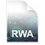

# Getting Started

## Installation

Download the [latest version](https://drive.switch.ch/index.php/s/M8ddQOOOyJfyJVz/download) of RWA Creator (v1.4.7, 2026-08-13, [Release Notes]). At the moment, RWA Creator is only available for macOS. Linux and Windows versions will be available in the future.

[Release Notes]: release-notes.md

Open the downloaded disk image, open it and move the `RWA Creator.app` to your Applications folder. You can then launch the application from there.

## First Steps

When you first open RWA Creator, it will ask you to save a new project. Choose a location on your computer and give your project a name. This will create a new folder containing your project file with the extension `.rwa`. Next to it you will find a folder named `assets`, where all the audio files and Pure Data patches will be placed. Also, the folders `tilecache`, `tmp`, and `undo` will be created, which are used internally by RWA Creator and can be ignored for now.

```text
SoundWalk/
├── SoundWalk.rwa
├── assets/
├── tilecache/
├── tmp/
└── undo/
```

You can recognise the RWA project file by its icon:



After creating a new project, you will see the main interface of RWA Creator, which consists of six views: [Map View](./map-view.md), [Game View](./game-view.md), [Scene View](./scene-view.md), [State View](./state-view.md), History View and [Log View](./log-view.md). You can freely arrange these views by dragging and dropping them to your preferred layout, or having them float as separate windows.
