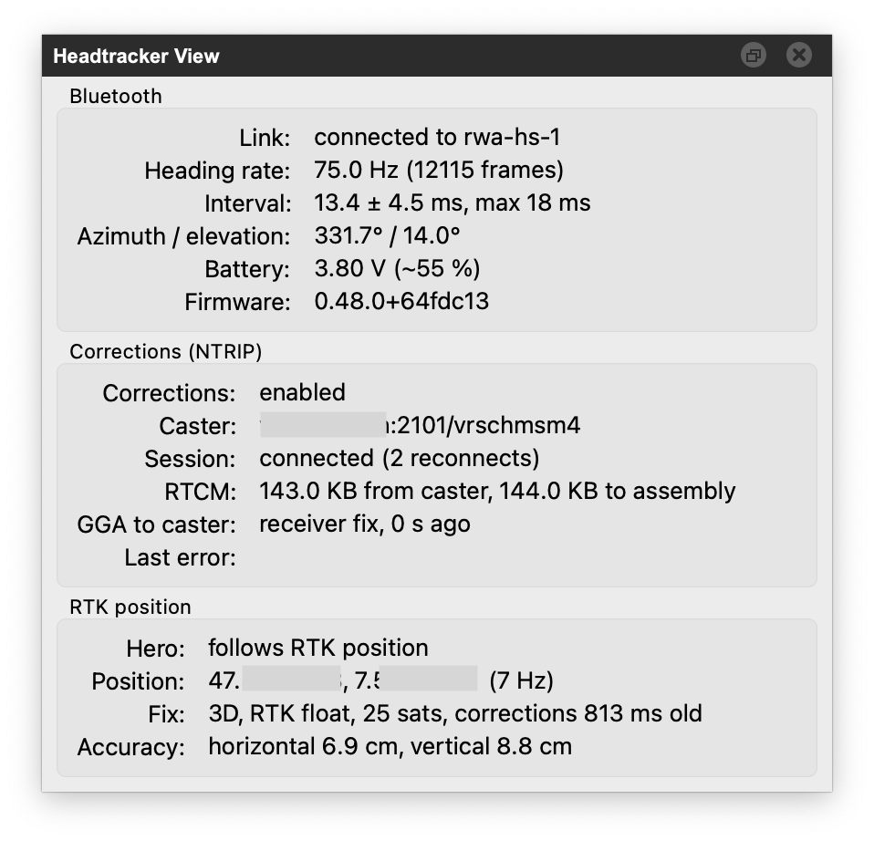

# Headtracker View

Live numbers of the headtracker connected to RWA Creator, refreshed once a second.
Open it with *View > Headtracker View* (it starts hidden; *Gather Views* shows it too).
The controls it reports on live in the [Headtracker menu](./getting-started.md#headtracker).

Check out [Using a Headtracker](../creating-soundwalks/using-a-headtracker.md) and [Live GPS in RWA Creator](../creating-soundwalks/live-gps-in-rwa-creator.md) for more details.

/// caption
**Headtracker View**: Connected to RTK headtracker "rwa-hs-1",
with RTK float positioning in centimetre-level precision and 75.0 Hz headtracker rate.
///

## Bluetooth

- **Link**: the connected device name, or a reminder which name *Connect via Bluetooth* looks for.

- **Heading rate**: heading frames per second and the count since connecting. An RTK headtracker on firmware 0.48.0
  or newer delivers about 70 frames per second; older firmware and the plain RWA headtracker considerably fewer.

- **Interval**: mean, standard deviation and maximum of the time between two heading frames. This is the
  head-tracking latency budget of the Bluetooth link: a maximum well under 30 ms means the link is not the reason
  a sound lags behind your head. Tails of 100 ms and more point at radio interference or another Bluetooth
  device competing for the link.

- **Azimuth / elevation**: the calibrated orientation the Hero currently uses.

- **Battery**: the assembly's LiPo voltage with a rough percentage (linear between 3.3 V empty and 4.2 V full;
  the firmware reports voltage only). Reported every 15 seconds; *stale* means no heartbeat arrived recently.
  Plain RWA headtrackers report no battery.

- **Firmware**: the assembly's firmware version.

## Corrections (NTRIP)

Only relevant for an RTK headtracker.

- **Corrections**: whether *Headtracker > NTRIP Corrections* is enabled.

- **Caster**: the configured caster as `host:port/mount point`.

- **Session**: the state of the caster session: *idle*, *connecting*, *connected*, *reconnecting* (with the number
  of reconnects) or *disconnected*. "Assembly has no RTCM downlink" means the connected headtracker runs firmware
  older than 0.48.0, which fetches its own corrections and needs none from RWA Creator.

- **RTCM**: bytes received from the caster and bytes written to the headtracker; a *dropped* count appears when
  the Bluetooth link could not keep up (a stall drops the oldest corrections, the receiver resyncs on the newest).
  Expect roughly 1 to 1.5 KB per second while connected.

- **GGA to caster**: where the position the caster gets comes from. *Receiver fix* once the headtracker has a
  fix; *hero position* before that (the caster needs a rough position to start streaming, so the Hero's place
  on the map is sent until the receiver knows better).

- **Last error**: the reason for the last failed or dropped session, for example refused credentials,
  an unknown mount point or a timeout. Cleared when the next session connects.

## RTK position

- **Hero**: whether the Hero follows the headtracker's position (*Headtracker > Hero Follows RTK Position*).

- **Position**: the latest fix in WGS 84 coordinates (degrees) and its rate (up to 10 Hz),
  or how long ago the last fix arrived.
  *No fix* while the receiver is still acquiring; without corrections that fix is a plain GNSS position (metres),
  with corrections a centimetre-level RTK one.

- **Fix**: the receiver's own verdict, once a second: fix type (*3D* is normal),
  carrier solution (*no RTK*, *RTK float*, *RTK fixed*), satellites used, and the age of the last correction applied.
  *RTK fixed* with corrections a few seconds old is the target;
  *no corrections yet* means the caster session has not delivered (see the Corrections group).
  *Stale* means the receiver stopped delivering solutions.

- **Accuracy**: the receiver's horizontal and vertical accuracy estimates.
  Metres without corrections, a few centimetres at *RTK fixed*.
