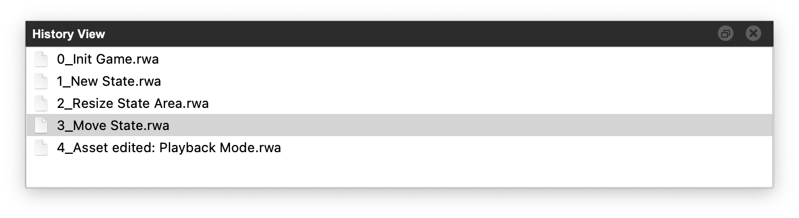

# History View

This view provides **undo/redo** functionality. Snapshots (undo/redo steps), are written for every editing interaction. Click on the step to revert to that version of the project.

/// caption
**History View**: List of snapshots (undo/redo steps)
///

!!! info "Snapshots"
    The snapshots themselves are versions of the project files, stored in the `undo` folder of the project. When copying the project to an iPhone, make sure to ***not*** include this folder, as every snapshot will show up as an individual game in the [RWA Player]. When exporting the game, this undo folder will be automatically removed (see [FAQ: How to copy a game to the iPhone]).

[RWA Player]: ../rwa-player/games-view.md
[Transferring Projects]: exporting-rwa-projects.md
