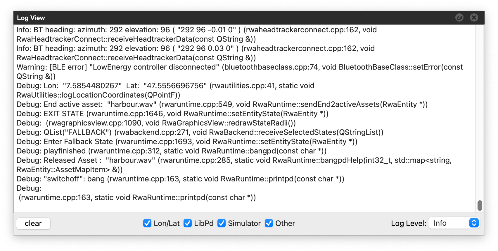

# Log View

This view is useful for debugging and understanding what is happening in RWA Creator. You can watch if states are activated, assets are loaded, etc.

/// caption
**Log View** shows the log of the RWA Creator and its components.
///

## Controls

- **Clear Log**: Clears the log window.

### Filters

- **Coords** toggle: Coordinates (latitude and longitude, [WGS-84](https://en.wikipedia.org/wiki/World_Geodetic_System)) of locations pointed at on the map.
- **LibPd** toggle: Messages of *dynamic Pure Data* patches.
- **Simulator** toggle: Log messages of the simulator.
- **Other** toggle: Log messages of other components of RWA Creator, such as headtracker-data, the map view, game view, scene view, and state view.
- **Log Level** dropdown: Filters the log messages based on their severity level. The available levels are:
    - Debug: Shows all log messages, including detailed debugging information.
    - Info: Relevant information about running scenes, etc.
    - Warning: Things that went wrong.
    - The other levels are not in use at the moment.
