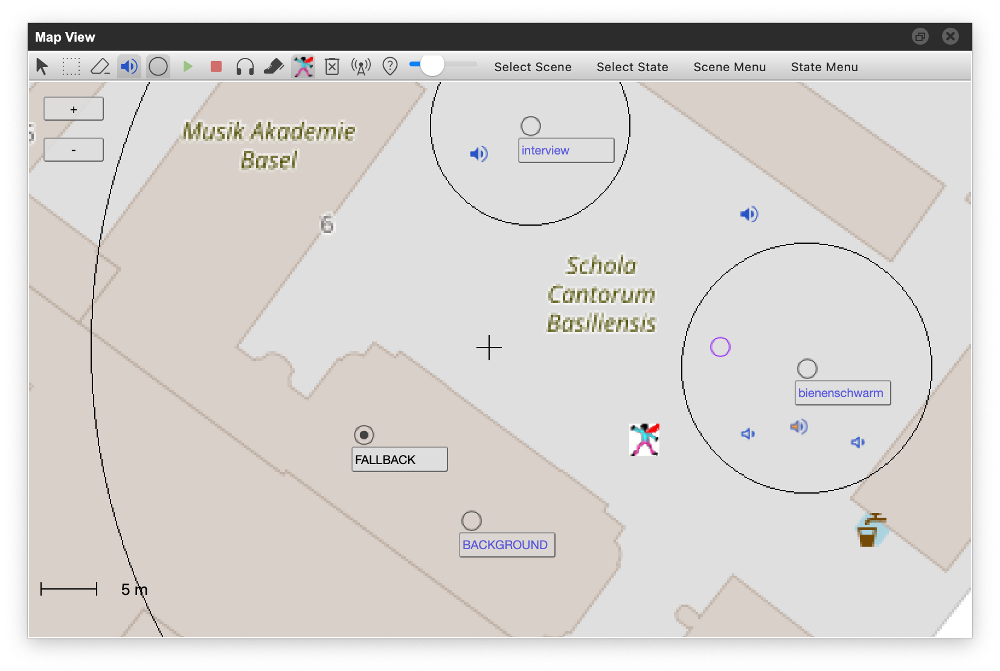
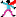

# Map View

/// caption
**Map View** is the main view of the RWA Creator. It allows for creating and editing **scenes** and **states**, and for driving the simulation.
///

A small **crosshair** marks the center of the map. New scenes and states created through the *Scene Menu* and *State Menu* are placed at the crosshair, and *Move Scene to Map Coordinates* moves the current scene there.
Pan the map until the spot you want sits under the crosshair, then use the menu.

## Toolbar

### Tools

:rwa-arrow: **Arrow**: double clicking in *Map View* creates a new *state*. Clicking on an existing *state* selects it; click+drag moves an existing *state*; click+drag on the map moves the map.

:rwa-pen: **Selection**: Rectangular selection of *states*; click and drag on the map to select multiple *states* (used by *New Scene from Selected States* and *Copy selected States to Clipboard*, see [Menus](#menus)).

:rwa-rubber: **Rubber**: Click on *states* to delete them. The *Fallback* and *Background* states of a scene can not be deleted.

### Editing scene and state areas

With the *Arrow* tool, the area of the **selected** scene or state can be edited directly on the map:

- **Circle**: drag the circumference to change the radius.
- **Rectangle / Square**: drag one of the edges to change width or height (a square keeps both equal).
- **Polygon**: drag a vertex to move it, **double-click on an edge** to insert a new vertex there, and **double-click on a vertex** to delete it.
- Drag the center icon to move the whole scene or state (unless *Lock Position* is set, see [Game View](./game-view.md) and [Scene View](./scene-view.md)). With *States follow scene* / *Assets follow state* enabled, the children move along.

!!! tip "Assets are shown here, but edited in the State View"
    The Map View draws the assets of the current state (toggle :rwa-audiosource:),
    so you can see how a state sounds in relation to its surroundings.
    Assets are moved and edited in the [State View](./state-view.md) only;
    clicking them on the map has no effect.

### Show assets/radii

:rwa-audiosource: **Blue speaker**: toggle display of assets in *Map View*

:rwa-radiiVisibleButton: **State circle**: toggle display of state radii in *Map View*

### Start/Stop Simulation

:rwa-start: **Green play button**: starts simulation or restarts a running simulation, ++command+r++

:rwa-stop: **Red stop button**: stops simulation, ++command+k++

While the simulation runs, the Hero can be dragged across the map, and states and scenes are activated and deactivated as
if you were walking. Deleting scenes, states or assets is refused while the simulation runs.

### :rwa-calibrateHeadtrackerButton: Calibrate Headtracker

With a [headtracker](#headtracker) connected, point the headphones in the direction that should be *north* and press the button:
RWA Creator averages the next few orientation readings and uses them as the north / zero offset from now on.
While it collects (a fraction of a second), no orientation data is forwarded; the [Log View](./log-view.md) reports *Done Calibrating*.
Without calibration, the tracker's own idea of north is used (indoors a bit inaccurate at times, usually off by a constant angle).

### :rwa-headtrackerStepButton: Send Step

Simulates one footstep: the same event the headtracker's step detector produces when you walk.
Pd patch assets that listen to `[r $0-step]` receive a bang, and the step is forwarded as `/step` to every registered RWA Player (see [Technical Details](../faq/technical-details.md)).
Useful for testing footstep-driven patches without walking.

###  Hero Follows Selection
<!-- TODO: this is missing an SVG Icon -->

When active, the hero jumps to the center of the scene or state selected through the *Select Scene* or *Select State* menus. This is useful for debugging the game in simulation mode, as you can place the hero into a state/scene without having to move through other states/scenes i.e. dragging the hero around.

!!! tip "Only applies to menu-selection"
    "Hero Follows Selection" only applies to the *Map View* **menu selection**, not for selection by clicking on list entries in *Game*- or *State View*!

### Toggle remove assets on delete

:rwa-donttrashassets: **Don't Trash**: Deleting assets from the *State View* asset list leaves the files in the projects asset folder.

:rwa-trashassets: **Trash**: Deleting an asset also removes its referenced files (audio or pd patch).

!!! tip "A removed file is not deleted permanently"
    It is kept in a session trash inside the project's `tmp` folder, and reverting to an earlier snapshot in the [History View](./history-view.md) brings both the asset entry and its file back.
    On quitting RWA Creator (or opening another project) the session trash is moved to the system trash.
    From there, a file can only be brought back manually, by moving it into the project's `assets` folder again.

### :rwa-syncwithclients: Toggle Sharing Server

When active, RWA Creator serves the exported projects to the local network, for RWA Clients to download them (see [transfer projects over WiFi]).

[transfer projects over WiFi]: ../creating-soundwalks/transferring-projects.md#transfer-projects-over-wifi

### :rwa-findlocation: Location Lookup

Open dialog to lookup map locations. Suggestions and coordinates are provided by an online service (Open Street Maps nominatim server or Swisstopo geoservice)[^geoservice-lookup].
Choosing a suggestion **pans the map** to that place, it does not move any scene. To bring the current scene
there, use *Scene Menu > Move Scene to Map Coordinates* afterwards (the Hero is moved along).

[^geoservice-lookup]: **Rate Limits, Changes for H.E.I. Campus**:
    The documentation for the [OSM Nominatim Service](https://operations.osmfoundation.org/policies/nominatim/)
    that provides the location lookup, describes its use for auto-complete search as "*unacceptable use*".
    The requirements further state: "*No heavy uses (an absolute maximum of 1 request per second)*".
    For **H.E.I. Campus**, the location lookup was switched to the
    [Swisstopo REST web geoservices](https://www.swisstopo.admin.ch/en/rest-api-geoservices-reframe-web).

### Main volume

The unlabelled slider at the right end of the toolbar is the **master volume** of the simulation (0-400%, default 100%).
It sits *after* all scene, state and asset gains and is only meant for your listening comfort while working.
It does not prevent clipping, and it is not saved with the project.
For balancing the soundwalk itself, use the gains described in [Mixing Soundwalks](../creating-soundwalks/mixing-soundwalks.md).

### Menus

- **Select Scene**: select the current scene. The map moves to the scene (not while the simulation runs).
- **Select State**: select the current state. The map moves to the selected state.

    While  *Hero Follows Selection* is active,
    both **Select Scene** and **Select State** will teleport the hero to the center point of the state / scene,
    also when the simulation is running.

- **Scene Menu**:
    - *Append*: create a new scene (with its *Fallback* and *Background* states) at the crosshair.
    - *Remove*: delete the current scene. The last remaining scene can not be removed.
    - *Duplicate*: deep-copy the current scene with all its states and place the copy at the crosshair.
    - *Clear*: delete all states of the current scene and recreate empty *Fallback* and *Background* states.
    - *New Scene from Selected States*: move the states selected with the :rwa-pen: *Selection* tool into a new scene.
    - *Move Scene to Map Coordinates*: move the current scene (with all its states and assets) to the crosshair,
      and teleport the Hero there. This is how you place a freshly created project at your site, see
      [Getting Started](./getting-started.md#first-steps).
    - *Copy selected States to Clipboard* / *Paste States to Current Scene*: copy states between scenes,
      ==and between projects==: the referenced audio and Pd files are copied into the target project's `assets`
      folder (a same-named file with different content is stored as `name-2.ext`).
- **State Menu**:
    - *New State*: create a new GPS state at the crosshair (same as double-clicking).
    - *New State from Current*: duplicate the selected state in place, named `<name> copy`.

## Map legend

 **Hero**: Location of the listener

:rwa-scene: Center of a scene

:rwa-sceneselected: Center of selected scene

:rwa-state: Center of a state

:rwa-stateselected: Center of selected state

:rwa-audiosource: Asset (also center of rotation)

:rwa-audiosourceselected: Selected asset

:rwa-audiochannelsource: Channel source if asset has more than one channel

:rwa-audiosourcestartpoint: Starting point of moving asset

:rwa-audiosourcestartpoint1: Moving asset position

## Headtracker

The *Headtracker* menu in the menu bar connects RWA Creator to an RWA headtracker over Bluetooth LE, so the
simulation reacts to where you turn your head - sources stay put in the world while you look around.

- **Headtracker Name (…)**: enter the Bluetooth name printed on the headphones (for example `rwaht31` or
  `rtkrover-ca0ca7`). The name has to match exactly; there is no device picker.
- **Connect via Bluetooth**: scans for about 15 seconds and connects to the device with that name. The
  [Log View](./log-view.md) lists every BLE device found, so you can check the name if the connection fails.
  On first use macOS asks for Bluetooth permission.
- **Disconnect from Bluetooth**.

Once connected, the tracker's azimuth and elevation replace the Hero's head orientation, and its step detector
feeds the *step* events. [Calibrate](#calibrate-headtracker) to set north. Without a headtracker the Hero
always faces north: an asset north of the Hero is heard in front, east to the right, south behind.
