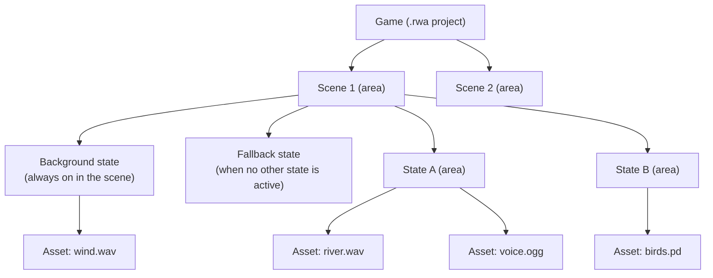

# General Game Structure

RWA Creator is a software where you can create GPS-based soundwalks, also referred to as *games*. The logic of the program allows you to define your own game by organizing and structuring space through three different layers of abstraction: *game*, *scene* and *state*.

## Layers

1. A **game** consists at least of one **scene**, which is located at a certain GPS position, and its geographical area is delimited by a shape (circle, rectangle or polygon) acting as its geofence.
2. A **scene** consists at least of two **states**: a *background* and a *fallback state*. The *background state* is always active for the whole *scene*. The *fallback state* is entered if no other (except the *background state*) is active. <!-- A new *state* can either be created by double clicking into the *map view*, or by select *new state* from the state menu. --> Every other state defines a geographical area of activation, like scenes.
3. A **state** is a container for **assets**. An asset can either be an *audio file* or a *Pure Data patcher*, that is placed at a specific location.

The *Background* and *Fallback* states are created with every scene and have **no area** of their own: they are entered by the engine, not by walking somewhere. Their state marker on the map is only an editing anchor and can be moved out of the way. The positions of their *assets*, on the other hand, matter just like anywhere else.

- All views display by default the last touched *scene*, *state* and *asset*. Therefore, if a state is touched within the *map view*, the *state view* automatically displays the same *state*.

## Moving Between Layers

To reframe: you can think of the layers as a hierarchy: a *game* is the top layer that contains one or more *scenes*, each *scene* is like a room that contains one or more *states*, and each *state* is like its own event happening inside a room, which can be composed of one or more *assets*.

Being aware of the nested logic described above helps you understand how *background* and *fallback* states can be used as "room noise" in a given *scene*, whereas regular GPS states are elements happening on top.

One of the beautiful creative aspects of the RWA environment is – as it is explained in detail in each of the *views* sections – the **sonic** and **spatial** complexity that is possible by playing with how elements from the same or different layers can transition between one another.
