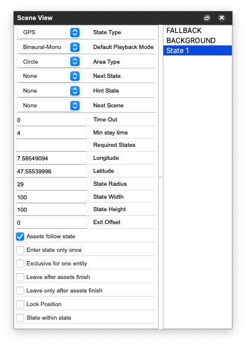

# Scene View

/// caption
**Scene View**: State Attributes (left), State List (right)
///

Selected states can be removed with the ++delete++ key. The selected state is visible in the *State Attributes* list.

| Attribute                     | Description                                                                                                     |
| ----------------------------- | --------------------------------------------------------------------------------------------------------------- |
| State Type                    | only GPS and other are working so far.                                                                          |
| Default Playback Mode         | default playback mode for all state assets.                                                                     |
| Area Type                     | circle or rectangle or square.                                                                                  |
| Next State                    | automatically enter the specified state as next state (use together with "Leave after assets finish" attribute) |
| Next Scene                    | automatically enter the specified scene as next state (use together with "Leave after assets finish" attribute) |
| Time Out                      | exit state after the specified time                                                                             |
| Required States               | entry condition, state is only entered if the specified states have been visited already.                       |
| State Radius                  |                                                                                                                 |
| State Width                   |                                                                                                                 |
| State Height                  |                                                                                                                 |
| Assets follow state           | in editing mode, assets are moved together with the state                                                       |
| Enter State only once         | state can only be entered once                                                                                  |
| Exclusive for one Entity      | not in use yet                                                                                                  |
| Enter Offset                  | offset in meters for entering a state radius; default is -6                                                     |
| Exit Offset                   | offset in meters for leaving a state radius; default is 0                                                       |
| Leave after assets finish     | exit state when assets are no longer active.                                                                    |
| eave only after assets finish | entity stays in the state as long as assets are active, even if the player is outside the state radius.         |

## Notes

**Leave after assets finish**: "Leave after asset finish" is useful for "*nextState*" sequences: If the hero enters a state where the attribute "*nextState*" or "*nextScene*" is set, this state/scene will be entered automatically after all assets finished playing.

**Leave only after assets finish**: If a state contains any looped assets, the attribute "*Leave only after assets finish*" should not be activated, otherwise the state is never exited because the assets never finish. Its purpose is rather to guarantee, that the hero gets all necessary information even if she already left the state radius. In this case, all assets will be played until the end and only afterwards the state will be left.
