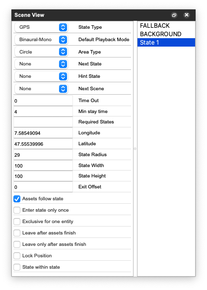

# Scene View

/// caption
**Scene View**: State Attributes (left), State List (right)
///

The *State List* shows all States of the selected Scene. Selected States can be removed with the ++delete++ key. The *State Attributes* show the attributes of the State selected in the *State List*. The Assets belonging to the selected State are shown in the *Asset List* in the [*State View*](state-view.md).

## State Attributes

| Attribute Name           | Default Value | Unit | Description                                                                                                                                       |
| ------------------------- | ------- | ---- | ------------------------------------------------------------------------------------------------------------------------------------------------- |
| State Type                | GPS     |  N/A  | 1. **GPS:** state playback spatially anchored to its respective location in Map View  2. **Fallback:** state playback stops when a regular GPS state is triggered, and starts playing again once no other state is playing within its parent Scene.   3. **Background:** state playback is permanent as long as hero remains within its parent Scene. *(only GPS, Fallback, and Background are working so far)*                                                                                    |
| Default Playback Mode      | Binaural-Mono   | N/A | Default playback mode for all state assets.                                                                                                                                             |
| Area Type                  | Circle   | N/A   | Shape of the scene (circle, rectangle, square, **polygon***) *= corners can be added to a given polygon shape by double-clicking any point of its sides. These corners can be clicked-and-drag to freely modify the polygon's area.           |
| Next State            | None    | N/A   | Automatically enter the specified state as next state (use together with "Leave after assets finish" attribute).        |
| Time Out              | 0     |   ms  | Exit state after the specified time.                                          |
| Min stay time         | 4     |   ms  | Specified minimum activation time for the given state before moving to the next one.                                      |
| Required States       | null  | N/A   | Entry condition, state is only entered if the specified states have been visited already.                               |
| Longitude             | Lon. coordinate   | Decimal Degrees    | The longitude coordinate for the given state.                                                          |
| Latitude              | Lat. coordinate   | Decimal Degrees    | The latitude coordinate for the given state.                                                          |
| State Radius          | 50    | m  | Radius distance of state when *Area Type = Circle*. |
| State Height          | 100   | m  | Height distance of state when *Area Type = Rectangle* or *Square*. |
| State Width           | 100   | m  | Width distance of state when *Area Type = Rectangle* or *Square*. |
| Exit offset           | 0     | m  | Specified distance offset for exiting the given state.               |
| Assets follow state   | true | toggle | In editing mode, assets are moved together with the state.                              |
| Enter state only once   | false | toggle | State initiate only in the first instance of entry.                              |
| Exclusive for one entity  | false | toggle | **Not in use yet**                              |
| Leave after assets finish | false | toggle | Automatically exits state when the assets' playback finishes.                           |
| Leave only after assets finish | false | toggle | Locks player into the given state and prevents their exit from state until the assets' playback time ends.                       |
| Lock position   | false | toggle | In editing mode, it becomes impossible to drag and change the state's position.                              |
| State within state   | false | toggle | **Not in use yet**                        |

## Notes

**Leave after assets finish**: "Leave after asset finish" is useful for "*nextState*" sequences: If the hero enters a state where the attribute "*nextState*" or "*nextScene*" is set, this state/scene will be entered automatically after all assets finished playing.

**Leave only after assets finish**: If a state contains any looped assets, the attribute "*Leave only after assets finish*" should not be activated, otherwise the state is never exited because the assets never finish. Its purpose is rather to guarantee, that the hero gets all necessary information even if she already left the state radius. In this case, all assets will be played until the end and only afterwards the state will be left.
