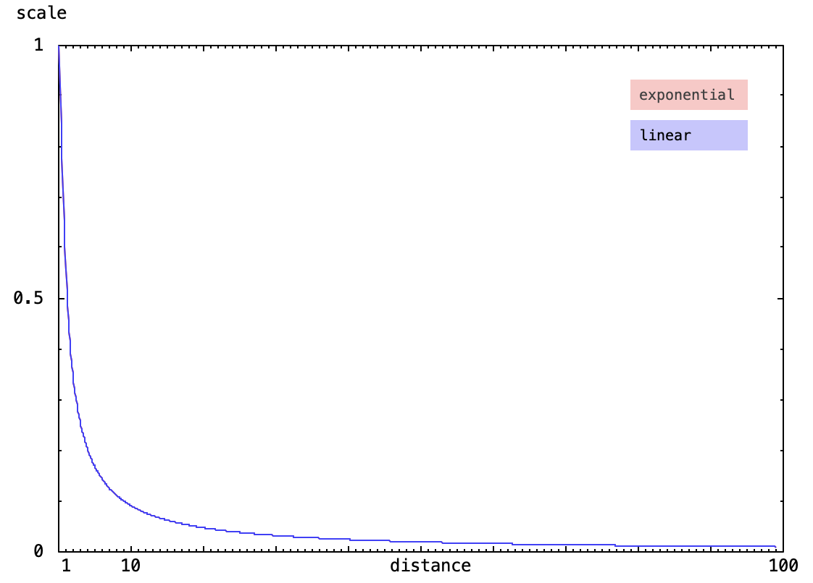
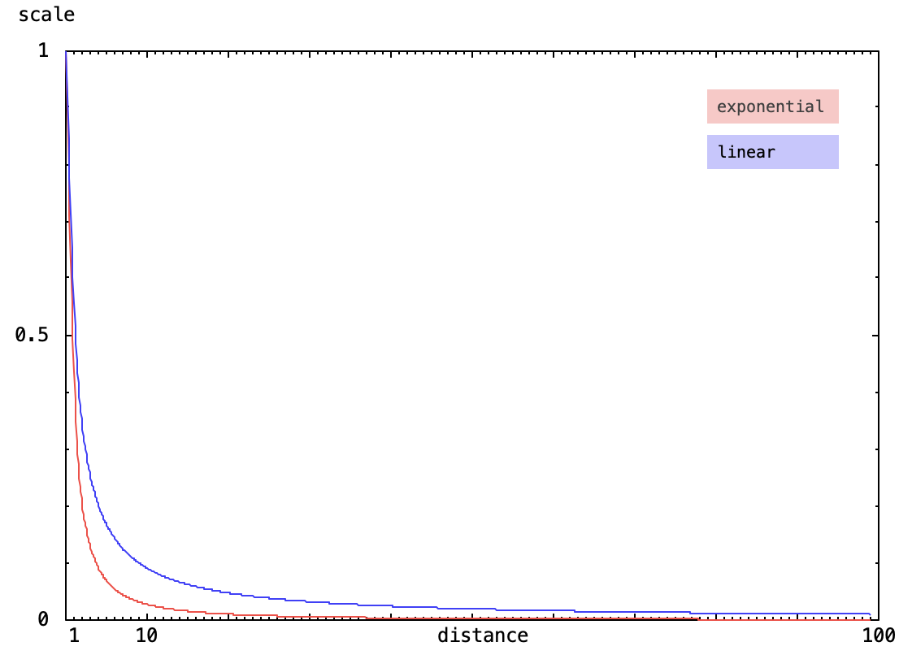
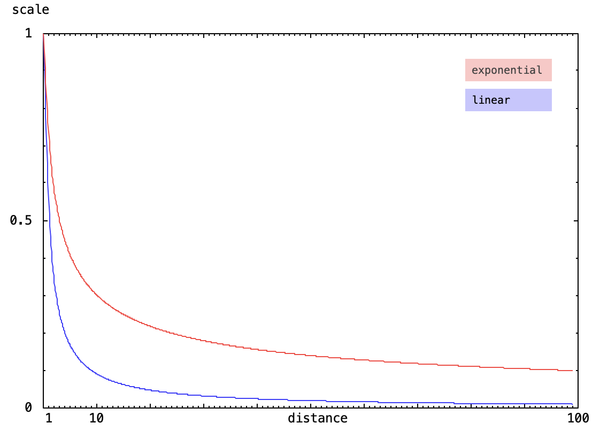

# State View

/// caption
**Asset Attributes** (left), **Asset List** (center), **Asset Map View** (right)
///

## General Usage

In the *Asset List*, assets can be added via drag & drop; so far only `.wav` and `.aif` files are working.
After adding an asset, it appears instantly in the *Asset Map View*, where it can be placed with the mouse.
Clicking on an asset either in the list or the map selects the corresponding asset;
its attributes are shown in the *Asset Attributes* list and can be edited there.
Several assets can be selected by holding down the Command-key and clicking on the assets in the list.
Their attributes then can be edited together.
An asset can be removed from a state with the Delete-key, if it is selected.
Click+drag allows for editing the state radius.

## Asset Attributes

| Attribute                 | Description                                                                                                                                       |
| ------------------------- | ------------------------------------------------------------------------------------------------------------------------------------------------- |
| Playback Mode             | auto types are not working yet, choose binaural or mono/stereo                                                                                    |
| Fade-In Time              |                                                                                                                                                   |
| Fade-Out Time             |                                                                                                                                                   |
| Crossfade Time            | crossfade time if loop is activated                                                                                                               |
| Gain                      |                                                                                                                                                   |
| Channel Radius            | distance from center for multichannel binaural playback                                                                                           |
| Rotate Frequency          | Rotations per second                                                                                                                              |
| Rotate Offset             | Angle offset in degrees                                                                                                                           |
| Moving Speed              | in m/s for moving assets, if attribute Move is activated                                                                                          |
| Fixed Orientation         | assets keeps the same orientation relative to the player after entering the corresponding state, independent from the specified asset coordinates |
| Fixed Elevation           |                                                                                                                                                   |
| Fixed Distance            | asset stays at specified distance after entering the state, independent from the specified asset coordinates                                      |
| Exclusive                 | XXX                                                                                                                                               |
| Loop                      | asset will be looped with the specified crossfade time                                                                                            |
| Stop Loop at End-Position | loop playback will stop after reaching the end position                                                                                           |
| Raw sensors to pd         | XXX                                                                                                                                               |
| GPS to pd                 | Forward lat/lon to Pure Data (`$0-lat`, `$0-lon`)                                                                                                 |
| Play only once            | XXX                                                                                                                                               |
| Rotate                    | Rotate the channels of a multi-channel binaural setup around the assets center                                                                    |
| Move                      | if activated, asset will move from specified start to specified end position. The coordinates can be edited in the Asset Map View.                |
| Damping Function          | Whether asset volume is affected by distance; if so, either linear oder exponential                                                               |
| Damping Factor            | factor in front of the Log Function, a value of 20 is natural damping in free-field (combined with damping trim of 1)                             |
| Damping Trim              | factor before the clipping occurs, 1 is for free field                                                                                            |
| Damping Min               | lower limit of *Damping Factor*                                                                                                                   |
| Damping Max               | upper limit of *Damping Factor*                                                                                                                   |
| Min Distance              | minimal possible distance to the corresponding asset.                                                                                             |

## Understanding Damping Parameters

You can choose to have no damping at all, in that case the sound will be just as loud no matter how far you are from the source.
That makes sense for certain types of sources, like environmental ambience or magical sounds that should be heard everywhere.

Damping on the other hand allows you to simulate how sound behaves in the real world, where it gets quieter as you move away from the source.
When you walk away from a sound source, it gets quieter - these parameters let you control exactly how that happens in the virtual environment.

### Damping Function: Linear vs. Exponential

/// caption
Amplitude scaling for *Linear Damping* or *Exponential Damping* with *Damping Factor* 20.
///

The "*Linear Damping Function*" is drawn from the inverse distance law ($a = 1/d$), where sound intensity decreases proportionally to the distance from the source.
This creates a predictable drop in volume as you move away, as perceived in open outdoor environments (i.e. *free-field conditions*).

The "*Exponential Damping Function*" allows to alter the physics of how the sound spreads through the environment:
Using the *Damping Factor* representing a propagation constant ($a = P \cdot \log_{10} d$), you can create a more dramatic drop-off that mimics how sound behaves in real-world conditions with obstacles, reflections, and atmospheric effects.

| Damping Factor | Spreading Type | Physical Environment                                | Loss per Double Distance |
| -------------- | -------------- | --------------------------------------------------- | ------------------------ |
| 10             | Cylindrical    | Shallow ocean, tunnels, low-ceiling halls           | -3 dB                    |
| 20             | Spherical      | Open air, "Free Space" (same as "linear")           | -6 dB                    |
| 30+            | Obstructed     | Dense forests, urban "canyons," high-friction media | -9 dB or more            |

/// caption
Amplitude scaling for *Damping Factor* 10.
///

/// caption
Amplitude scaling for *Damping Factor* 30.
///

#### When to use which

- Use **linear** (spherical spreading) for realistic open-air environments like parks, beaches, or meadows where sound travels naturally through free space without obstacles. Like a normal outdoor space - realistic sound travel similar to what you'd expect in a park or street.
- Use **exponential** with low damping factors (10-15) for enclosed or reflective environments like hallways, tunnels, or courtyards where sound carries further. Like sound traveling across a flat lake - it carries very far before getting quiet.
- Use **exponential** with high damping factors (30+) for obstructed environments like dense forests, urban areas with buildings, or indoor spaces with lots of furniture. Like sound in a thick forest - gets muffled quickly by obstacles.

#### Practical examples

- **Linear**: A street musician in an open plaza, birds singing in a field, wind blowing across an open landscape, normal conversation that feels natural as you approach or leave.
- **Exponential (5-10)**: A church bell that should be heard across the entire village, footsteps echoing in a subway tunnel, voices in a covered market, music in a large indoor space.
- **Exponential (30-40)**: A whispered secret that only works when you're very close, rustling leaves in a thick forest, conversation in a crowded café, whispers in a library.
