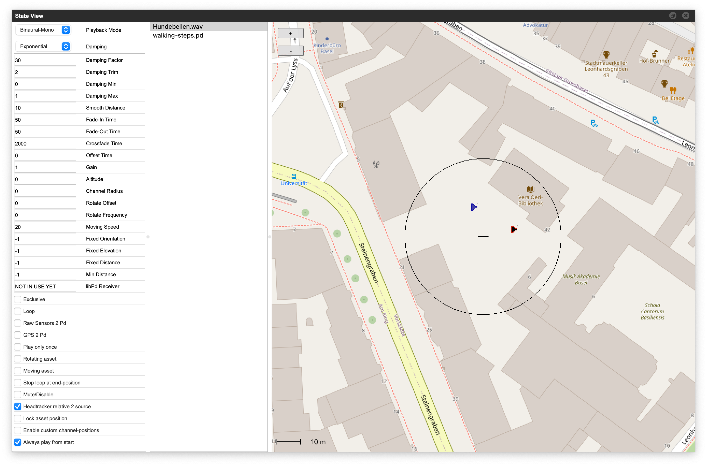

# State View

/// caption
**Asset Attributes** (left), **Asset List** (center), **Asset Map View** (right)
///

## General Usage

In the *Asset List*, assets can be added via drag & drop; so far only `.wav` and `.aif` files are working.
After adding an asset, it appears instantly in the *Asset Map View*, where it can be placed with the mouse.
Clicking on an asset either in the list or the map selects the corresponding asset;
its attributes are shown in the *Asset Attributes* list and can be edited there.
Several assets can be selected by holding down the ++command++ key and clicking on the assets in the list.
Their attributes then can be edited together.
An asset can be removed from a state with the ++delete++ key, if it is selected.
Click+drag allows for editing the state radius.

## Map legend

:rwa-state: Center of a state

:rwa-stateselected: Center of selected state

:rwa-audiosource: Asset (also center of rotation)

:rwa-audiosourceselected: Selected asset

:rwa-audiochannelsource: Channel source if asset has more than one channel

:rwa-audiosourcestartpoint: Starting point of moving asset

:rwa-audiosourcestartpoint1: Moving asset position

## Asset Attributes

| Attribute Name            | Default Value | Unit | Description                                                                                                                                       |
| ------------------------- | ------- | ---- | ------------------------------------------------------------------------------------------------------------------------------------------------- |
| Playback Mode             | Binaural-mono | N/A  | **Auto types are not working yet, choose binaural or regular mono/stereo**.                                                                                    |
| Damping              | Exponential      | N/A  | If asset volume is affected by distance, choose either *linear* or *exponential*, or fixed when it is not.                                                                                                              |
| Damping Factor            | 30.0    |      | Factor in front of the Log Function, a value of 20 is natural damping in free-field (combined with damping trim of 1).                             |
| Damping Trim              | 2.0     |      | Factor before the clipping occurs, 1 is for free field.                                                                                            |
| Damping Min               | 0.0     |      | Lower limit of *Damping Factor*.                                                                                                                   |
| Damping Max               | 1.0     |      | Upper limit of *Damping Factor*.                                                                                                                   |
| Smooth Distance           | 10.0    | ??   | **Not in use yet**                                                                                             |
| Fade-In Time              | 50      | ms   | Asset time from starting playback until full gain.                                                                                                                                                  |
| Fade-Out Time             | 50      | ms   | Asset time from full gain until finishing playback.                                                                                                                                                  |
| Crossfade Time            | 2000    | ms   | Crossfade time if loop toggle is activated.                                                                                                             |
| Offset Time            | 0    | ms   | Offset playback start.                                                        |
| Gain                      | 1.0     |      |                                                                                                                                                   |
| Altitude                   | 1.0     |  m    |                                                                   Z-offset.                                                                                                                                          |
| Channel Radius            | 20.0    | m    | Distance from center for multichannel binaural playback.                                                                                           |
| Rotate Frequency          | 0.0     | Hz   | Rotations per second.                                                                                                                              |
| Rotate Offset             | 0.0     | deg  | Angle offset in degrees.                                                                                                                           |
| Moving Speed              | 20.0    | m/s  | In m/s for moving assets, if attribute *Move* is activated.                                                                                          |
| Fixed Orientation         | -1.0    | deg  | Assets keeps the same orientation relative to the player after entering the corresponding state, independent from the specified asset coordinates. |
| Fixed Elevation           | -1.0    | m    | Assets keeps the same z-position relative to the player after entering the corresponding state, independent from the specified asset coordinates.                                                                                                                                                  |
| Fixed Distance            | -1.0    | m    | Asset stays at specified distance after entering the state, independent from the specified asset coordinates.                                      |
| Min Distance              | -1.0     | m     | Minimal possible distance to the given asset.                                                                                              |
| libPd Receiver            | N/A     | N/A    | **Not in use yet**                                 |
| Exclusive                 | false   | toggle     | **Not in use yet**                                                                                                                            |
| Loop                      | false   | toggle     | Asset will be looped with the specified crossfade time.                                                                                            |
| Raw Sensors 2 Pd         | false   | toggle     | **Not in use yet** Intended IMU data to Pure Data.                                                                                                                                             |
| GPS 2 Pd                 | false   | toggle     | Forward lat/lon to Pure Data (`$0-lat`, `$0-lon`).                                                                                                 |
| Play only once           | false   | toggle     | **Not in use yet**                                                                                                                                               |
| Rotating Asset           | false   | toggle     | Rotate the channels of a multi-channel binaural setup around the assets center.                                                                    |
| Moving Asset             | false   | toggle     | If activated, asset will move from specified start to specified end position. The coordinates can be edited in the Asset Map View.                |
| Stop loop at end-position | false   | toggle     | Loop playback will stop after reaching the end position.                                                                                           |
| Mute/disable | false   | toggle     | Disable asset.                                                                                           |
| Headtracker relative 2 source | true   | toggle     | In editing mode, the asset's playback responds relative to the movement of the connected headtracker.                   |
| Lock asset | false   | toggle  | Asset's position remains fixed to state.                                                                   |
| Enable custom-channel positions | false   | toggle     | When the asset's *Playback Mode* is *Binaural-Stereo*, it is possible to drag each channel separately to different positions in the map of the *State View*.                   |
| Always play from start          | true   | toggle     | Playback begins from the start of the asset's file when enabled. When disabled, playback begins where the last playback stopped.                 |

## Understanding Damping Parameters

You can choose to have no damping at all, in that case the sound will be just as loud no matter how far you are from the source.
That makes sense for certain types of sources, like environmental ambience or magical sounds that should be heard everywhere.

Damping on the other hand allows you to simulate how sound behaves in the real world, where it gets quieter as you move away from the source.
When you walk away from a sound source, it gets quieter - these parameters let you control exactly how that happens in the virtual environment.

### Damping Explorer

  

    

      

        <label for="damping-factor">Damping Factor</label>
        20
      

      <input type="range" id="damping-factor" min="1" max="60" step="1" value="20" class="input">
    

    

      

        <label for="damping-trim">Damping Trim</label>
        2.00
      

      <input type="range" id="damping-trim" min="0.1" max="3.0" step="0.05" value="2.0" class="input">
    

    

      

        <label for="damping-min">Damping Min</label>
        0.00
      

      <input type="range" id="damping-min" min="0" max="0.95" step="0.01" value="0" class="input">
    

    

      

        <label for="damping-max">Damping Max</label>
        1.00
      

      <input type="range" id="damping-max" min="0.05" max="2.0" step="0.01" value="1.0" class="input">
    

    

      

        Y Axis
        <label class="damping-choice" for="y-mode">
          <select id="y-mode" name="y-mode">
            <option value="amplitude">Amplitude</option>
            <option value="db" selected>dB</option>
          </select>
        </label>
      

      

        Damping Function
        <label class="damping-choice" for="damping-fn">
          <select id="damping-fn" name="damping-fn">
            <option value="none">None</option>
            <option value="linear">Linear</option>
            <option value="exponential" selected>Exponential</option>
          </select>
        </label>
      

    

    

      

        <label for="min-distance">Min Distance</label>
        1.0
      

      <input type="range" id="min-distance" min="0" max="20" step="0.1" value="1" class="input">
    

  

  

### Damping Function: Linear vs. Exponential

The "*Linear Damping Function*" is drawn from the inverse distance law ($a = 1/d$), where sound intensity decreases proportionally to the distance from the source.
This creates a predictable drop in volume as you move away, as perceived in open outdoor environments (i.e. *free-field conditions*).

The "*Exponential Damping Function*" allows to alter the physics of how the sound spreads through the environment:
Using the *Damping Factor* representing a propagation constant ($a = P \cdot \log_{10} d$), you can create a more dramatic drop-off that mimics how sound behaves in real-world conditions with obstacles, reflections, and atmospheric effects.

| Damping Factor | Spreading Type | Physical Environment                                | Loss per Double Distance |
| -------------- | -------------- | --------------------------------------------------- | ------------------------ |
| 10             | Cylindrical    | Shallow ocean, tunnels, low-ceiling halls           | -3 dB                    |
| 20             | Spherical      | Open air, "Free Space" (same as "linear")           | -6 dB                    |
| 30+            | Obstructed     | Dense forests, urban "canyons," high-friction media | -9 dB or more            |

#### When to use which

- Use **linear** (spherical spreading) for realistic open-air environments like parks, beaches, or meadows where sound travels naturally through free space without obstacles. Like a normal outdoor space - realistic sound travel similar to what you'd expect in a park or street.
- Use **exponential** with low damping factors (10-15) for enclosed or reflective environments like hallways, tunnels, or courtyards where sound carries further. Like sound traveling across a flat lake - it carries very far before getting quiet.
- Use **exponential** with high damping factors (30+) for obstructed environments like dense forests, urban areas with buildings, or indoor spaces with lots of furniture. Like sound in a thick forest - gets muffled quickly by obstacles.

#### Practical examples

- **Linear**: A street musician in an open plaza, birds singing in a field, wind blowing across an open landscape, normal conversation that feels natural as you approach or leave. Or water: use linear damping and place several binaural stereo sources further in the distance, to achieve a natural blend of sounds.
- **Exponential (5-10)**: A church bell that should be heard across the entire village, footsteps echoing in a subway tunnel, voices in a covered market, music in a large indoor space.
- **Exponential (30-40)**: A whispered secret that only works when you're very close, rustling leaves in a thick forest, conversation in a crowded café, whispers in a library.

## Minimum Distance Example

Minimum distance is set to -1 by default, which means that the damping function will be applied all the way to the source. If you want to ensure that the sound does not get too loud when you are very close to it, you can set a minimum distance. This will keep the volume at a safe level even when you are near the source.

- when using steep exponential damping curve, audio gets really loud at close distances. min distance will keep you at safe distance.
- for quieter sounds that are limited to a smaller area
- song/poem localised close to an object, but without having to use an extra state
