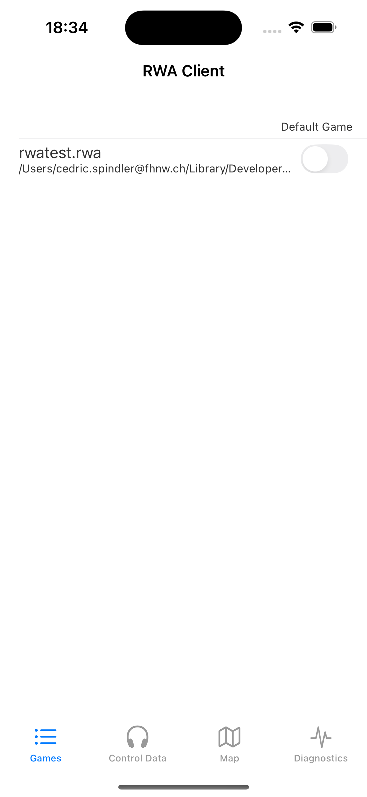

<!-- TODO: screenshot predates the current five-tab layout. re-take on a recent build. -->
{align=right width=33.333%}

# Games View

All RWA games on the phone appear in this list: every `.rwa` project in the app's *RWA Player* files folder
(the folder you see in the Finder's *Files* tab when the device is connected to your laptop by USB, see
[Transferring Projects](../creating-soundwalks/transferring-projects.md)).

Tapping a list entry loads that game and switches to the [Control View](./control-data-view.md), where you can
start it. Loading initialises the audio engine, which takes a few seconds.

!!! note "Restart after copying via USB"
    A game copied onto the device over USB only appears in the list after restarting the *RWA Player* app.
    Games fetched over WiFi appear immediately.

### Fetch Games

The **Fetch Games** button downloads all games offered by RWA Creator's Sharing Server, using the **IP address** set in the [Settings View](./settings-view.md). See [Transferring Projects](../creating-soundwalks/transferring-projects.md#transfer-projects-over-wifi).

!!! warning "Fetching replaces all games on the phone"
    **All games already on the phone are deleted before the new ones are loaded** (the app asks for confirmation first).
    Whatever the Sharing Server offers at that moment is what you end up with on the device.

### Default game

The game selected as **Default game** in the [Settings View](./settings-view.md) is loaded automatically when the app starts.
