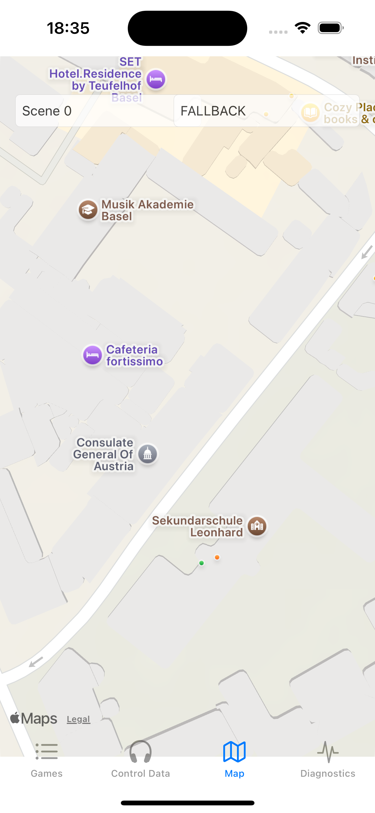

<!-- TODO: screenshot predates the current five-tab layout; re-take on a recent build. -->
{align=right width=33.333%}

# Map View

The *Map* tab shows (only) the **current scene** of the running game: its area, the areas of its GPS states, and a pin for every asset (depending on zoom level).
The two fields at the top display the names of the active scene and state (they stay empty until a game runs).

The listener appears as a walking-figure marker, labelled with the source of the position:

- **RTK** (green): position from the RTK headtracker.
- **GPS** (orange): position from the phone's internal GPS.
- **OSC**: position received from RWA Creator while registered.

The standard blue iOS location dot is shown as well; it always reflects the phone's *internal* GPS.
When the walking-figure marker and the blue dot drift apart,
you are looking at the difference between the RTK fix and the phone's own GPS.

!!! note "For checking, not for navigating"
    The map does not follow you while you walk, and only the current scene is drawn.
    It is a debugging aid for checking boundaries and positions on site.
    The walk itself is designed to be experienced by ear, with the phone in your pocket.

!!! warning "Positions from RWA Creator pause here"
    While this tab is on screen, positions sent from *RWA Creator* are not received.
    Keep the [Control View](./control-data-view.md) open while simulating (see [Simulating Location on the Phone](../creating-soundwalks/simulating-location-on-the-phone.md)).
